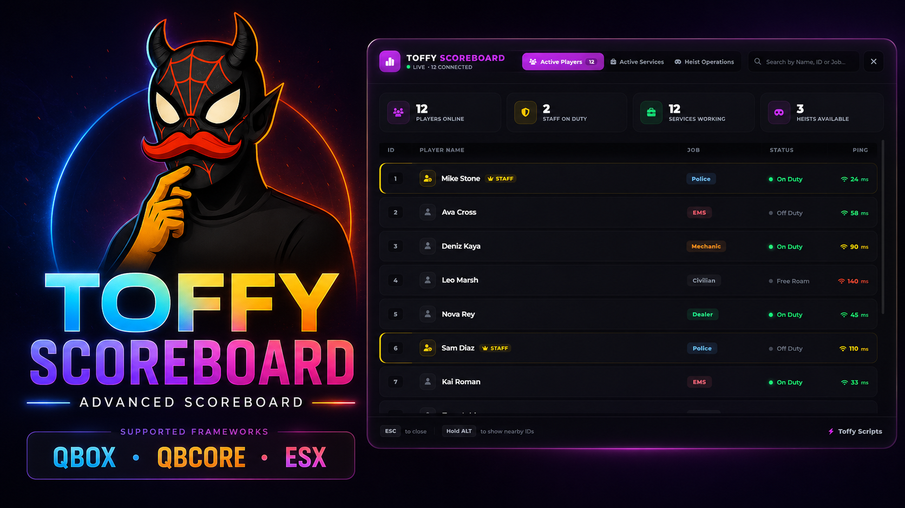

<div align="center">



# Toffy Scoreboard

**A clean, information-dense scoreboard for FiveM.**

Instead of a wall of names it gives you an actual dashboard: who's online, which services are staffed, and which heists are currently open, all in one panel that opens instantly and gets out of your way.

[](https://discord.gg/Qv58w3PX7R)
&nbsp;
[](#requirements)

</div>

Built for QBox first, with drop-in support for QBCore and ESX. Everything you'd normally want to touch lives in `config.lua`, so you can rebrand it to your server without opening the UI files.

## Requirements

None — it's standalone. Framework is auto-detected (`qbx_core` → `qb-core` → `es_extended`). If none is running the scoreboard still loads with basic player/ping data.

## Features

- Live player table with server ID, RP name, job, on/off duty state and colour-coded ping.
- Staff are highlighted automatically and pulled from your ACE perms or framework permission group.
- Per-service tracking with live counters and progress bars — colours follow each job.
- Heist board that flips between **Available** and **Locked** based on how many officers are on duty, with a manual override via exports.
- Overhead player IDs: hold **Left Alt** to see the server ID above nearby players.
- Full theming from config — accent, background and per-job colours, hex or FiveM ARGB.
- Privacy switches for servers that want to hide ping, hide jobs, or anonymise names for non-staff.

## Installation

1. Drop the `toffy-scoreboard` folder into your `resources` directory.
2. Add `ensure toffy-scoreboard` to your `server.cfg`.
3. Restart the server.

## Configuration

Open `config.lua` — the important bits:

| Setting | What it does |
| --- | --- |
| `Config.Framework` | `"auto"` by default. Force `"qbcore"`, `"qbx"` or `"esx"` if you want. |
| `Config.Language` | UI language. Ships with `"en"` and `"tr"`. |
| `Config.OpenCommand` | Chat command to open it. Default: `scoreboard`. |
| `Config.OpenKey` | Default keybind, remappable by players in settings. Default: `F6`. |
| `Config.Privacy` | Toggle `HidePing`, `HideJobs`, `AnonymousNames`, `UseRPName`. |
| `Config.Theme` | Panel and accent colours (see below). |
| `Config.TrackedJobs` | The jobs shown on the Services tab — label, icon and colour each. |
| `Config.Heists` | Heist list with the officer count required to unlock each one. |

### Theme

Every colour in `Config.Theme` accepts standard hex (`#be2edd`) or FiveM ARGB (`FFC41B08`):

- `Primary` — main accent (the purple you see everywhere)
- `Success` / `Danger` / `Gold` — status colours (on duty / locked / staff)
- `BackgroundDark`, `PanelBackground`, `CardBackground` — surface tones

Job colours are read from each entry in `Config.TrackedJobs`, so a player's job chip, the service icon and its progress bar all stay in sync.

### Tracked jobs & heists

`Config.TrackedJobs` is just a list — add, remove or reorder freely:

```lua
{ job = "police", label = "Police", icon = "fa-solid fa-shield-halved", color = "#60a5fa" },
```

`Config.Heists` controls the heist board. `minCops` is how many **on-duty** police are needed before it shows as available:

```lua
{ id = "fleeca", label = "Fleeca Bank", icon = "fa-solid fa-building-columns", minCops = 1, enabled = true },
```

Icons are [Font Awesome 6](https://fontawesome.com/icons) class names.

## Exports

Drive heist availability from your own heist scripts:

```lua
-- Force a heist state (e.g. lock it during a cooldown)
exports['toffy-scoreboard']:SetHeistStatus('fleeca', 'unavailable')

-- Hand control back to the automatic cop-count logic
exports['toffy-scoreboard']:ResetHeistStatus('fleeca')
```

Status changes are pushed live to every open scoreboard — no reopen needed.

## Usage

- Type `/scoreboard` or press your bound key (default **F6**) to open it.
- **ESC** or the same key closes it.
- Hold **Left Alt** to show server IDs above nearby players.

## Support

Questions, bugs or custom work? Join the Discord and message me directly:

**➜ [discord.gg/Qv58w3PX7R](https://discord.gg/Qv58w3PX7R)**
1
